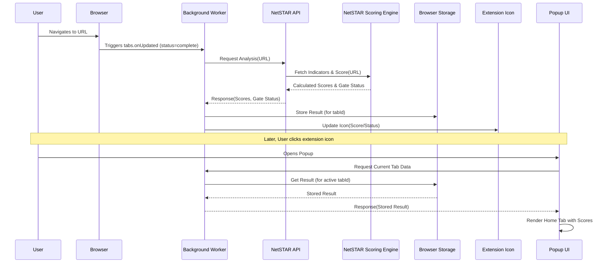
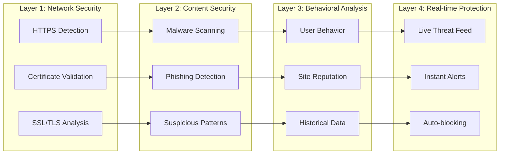
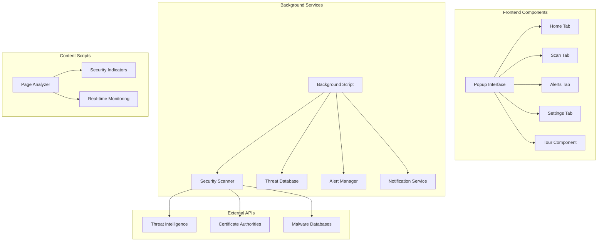
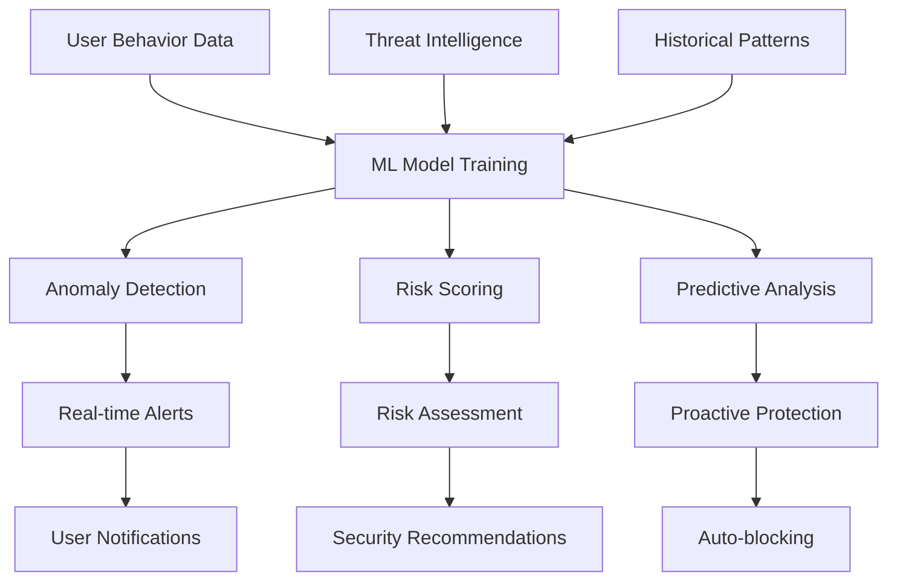
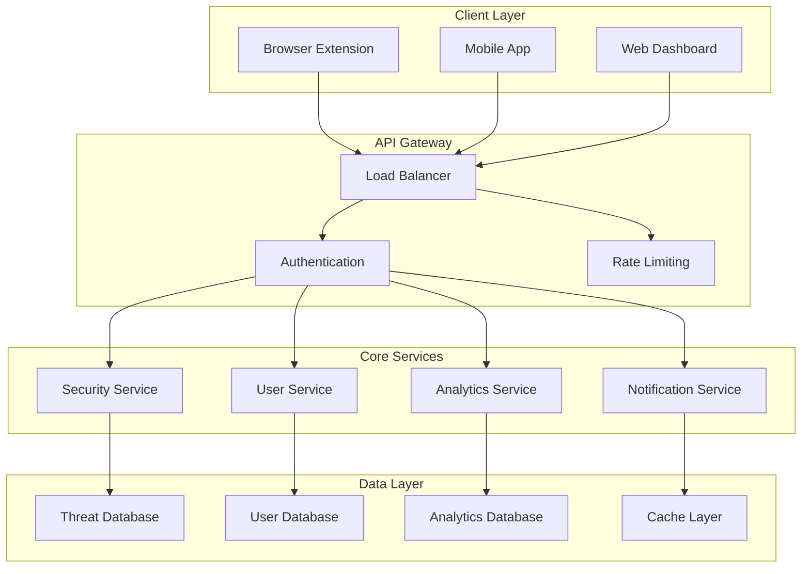
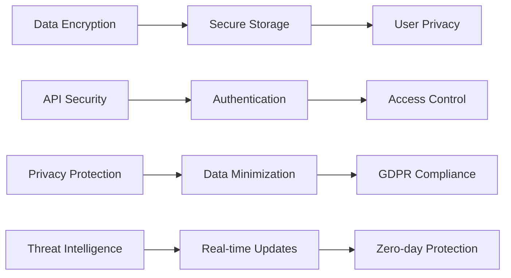
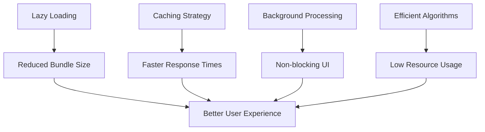

# NetSTAR Extension Architecture

This document outlines the future architecture and design patterns for the NetSTAR browser extension.

## System Overview

```mermaid
graph TB
    subgraph "Browser Extension"
        A[Popup UI (React)]
        B[Background Service Worker]
        A <-->|chrome.runtime.sendMessage| B
    end

    subgraph "Browser Environment"
        C[Current Tab URL / User Input]
        D[Extension Icon]
        E[Browser Storage]
        F[User Interface Display]

        B -->|Reads| C
        B -->|Updates| D
        B -->|Reads/Writes| E
        A -->|Renders| F
    end

    subgraph "NetSTAR Backend"
        G[Service Bus / API Endpoint]
        H[Scoring Engine<br/>Gate & Grade Logic]
        G <--> H
    end

    B -->|1. Requests Analysis (URL/IP)| G
    G -->|2. Sends Final Scores & Gate Status| B

    style A fill:#e1f5fe
    style B fill:#f3e5f5
    style G fill:#fff3e0
    style H fill:#e8f5e8
```

## Data Flow Architecture



## Security Layers



## Component Architecture



## Future Enhancements

### Machine Learning Integration



### Microservices Architecture



## Technology Stack

### Current Stack
- **Frontend**: React 19, Tailwind CSS, Lucide Icons
- **Build Tool**: Vite
- **Extension Framework**: Chrome Extension Manifest V3
- **State Management**: React Hooks

### Future Stack Considerations
- **Backend**: Node.js with Express/Fastify
- **Database**: PostgreSQL with Redis cache
- **ML/AI**: TensorFlow.js for client-side ML
- **Real-time**: WebSockets for live updates
- **Monitoring**: Prometheus + Grafana
- **Security**: OAuth 2.0, JWT tokens

## Development Roadmap

### Phase 1: Core Security Features
- [ ] Basic URL scanning
- [ ] Certificate validation
- [ ] Malware detection
- [ ] User interface completion

### Phase 2: Advanced Analytics
- [ ] Behavioral analysis
- [ ] Risk scoring algorithms
- [ ] Historical data tracking
- [ ] Advanced reporting

### Phase 3: Machine Learning
- [ ] Anomaly detection models
- [ ] Predictive threat analysis
- [ ] Automated response systems
- [ ] Continuous learning

### Phase 4: Enterprise Features
- [ ] Multi-user management
- [ ] Centralized administration
- [ ] API integrations
- [ ] Custom security policies

## Security Considerations



## Performance Optimization



---

*This architecture document will be updated as the project evolves and new requirements emerge.*

