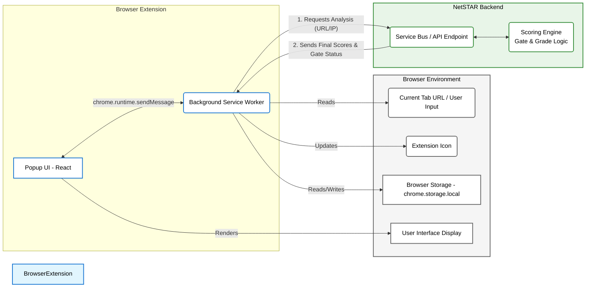
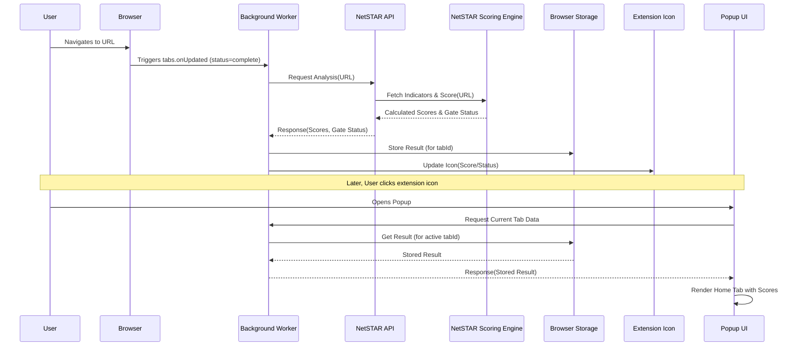

# NetSTAR Extension Architecture

This document outlines the future architecture and design patterns for the NetSTAR browser extension.

## System Overview

```mermaid
graph LR
    subgraph Browser Extension [Browser Extension]
        direction TB
        A[Popup UI - React]
        B(Background Service Worker)
        A <-->|chrome.runtime.sendMessage| B;
    end

    subgraph Browser [Browser Environment]
        direction TB
        C(Current Tab URL / User Input)
        D(Extension Icon)
        E[Browser Storage - chrome.storage.local]
        F[User Interface Display]

        B -- Reads --> C;
        B -- Updates --> D;
        B -- Reads/Writes --> E;
        A -- Renders --> F;
    end

    subgraph NetSTARBackend [NetSTAR Backend]
        direction TB
        G(Service Bus / API Endpoint)
        H(Scoring Engine <br/> Gate & Grade Logic)
        G <--> H;
    end

    B -- 1. Requests Analysis (URL/IP) --> G;
    G -- 2. Sends Final Scores & Gate Status --> B;

    style BrowserExtension fill:#e1f5fe,stroke:#1976d2,stroke-width:2px,color:#000
    style Browser fill:#f5f5f5,stroke:#666,stroke-width:2px,color:#000
    style NetSTARBackend fill:#e8f5e8,stroke:#388e3c,stroke-width:2px,color:#000
    style A fill:#fff,stroke:#1976d2,stroke-width:2px,color:#000
    style B fill:#fff,stroke:#1976d2,stroke-width:2px,color:#000
    style C fill:#fff,stroke:#666,stroke-width:2px,color:#000
    style D fill:#fff,stroke:#666,stroke-width:2px,color:#000
    style E fill:#fff,stroke:#666,stroke-width:2px,color:#000
    style F fill:#fff,stroke:#666,stroke-width:2px,color:#000
    style G fill:#fff,stroke:#388e3c,stroke-width:2px,color:#000
    style H fill:#fff,stroke:#388e3c,stroke-width:2px,color:#000
```

## Data Flow Architecture

```mermaid
sequenceDiagram
    participant User
    participant Browser
    participant ServiceWorker as Background Worker
    participant NetSTAR_API as NetSTAR API
    participant NetSTAR_Scoring as NetSTAR Scoring Engine
    participant BrowserStorage as Browser Storage
    participant ExtensionIcon as Extension Icon
    participant PopupUI as Popup UI

    User->>Browser: Navigates to URL
    Browser->>ServiceWorker: Triggers tabs.onUpdated (status=complete)
    ServiceWorker->>NetSTAR_API: Request Analysis(URL)
    NetSTAR_API->>NetSTAR_Scoring: Fetch Indicators & Score(URL)
    NetSTAR_Scoring-->>NetSTAR_API: Calculated Scores & Gate Status
    NetSTAR_API-->>ServiceWorker: Response(Scores, Gate Status)
    ServiceWorker->>BrowserStorage: Store Result (for tabId)
    ServiceWorker->>ExtensionIcon: Update Icon(Score/Status)

    Note over User, PopupUI: Later, User clicks extension icon

    User->>PopupUI: Opens Popup
    PopupUI->>ServiceWorker: Request Current Tab Data
    ServiceWorker->>BrowserStorage: Get Result (for active tabId)
    BrowserStorage-->>ServiceWorker: Stored Result
    ServiceWorker-->>PopupUI: Response(Stored Result)
    PopupUI->>PopupUI: Render Home Tab with Scores
```

